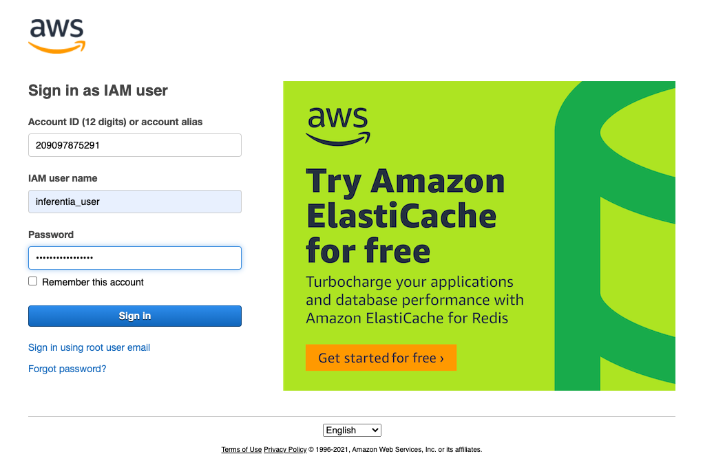
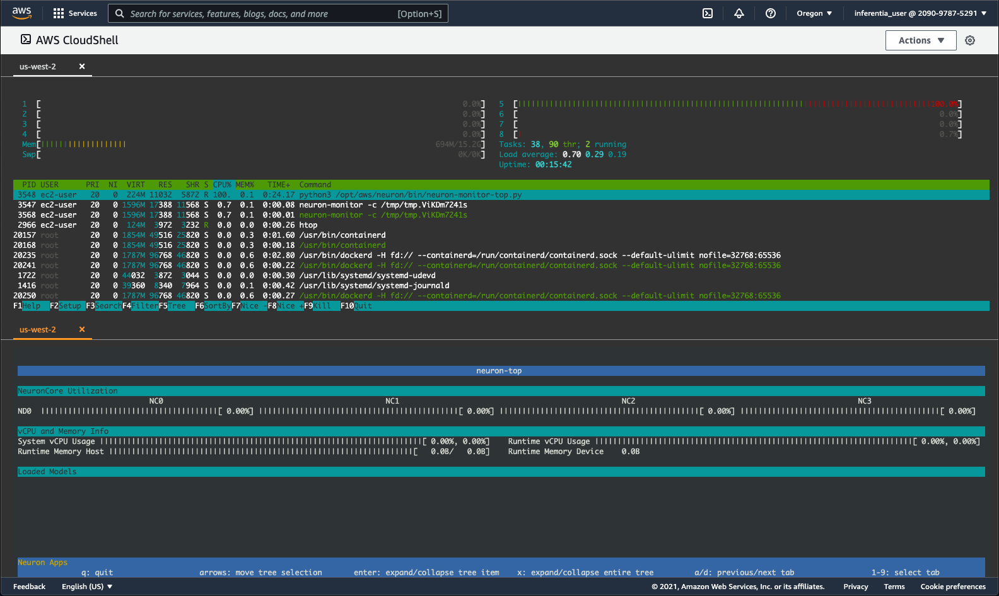
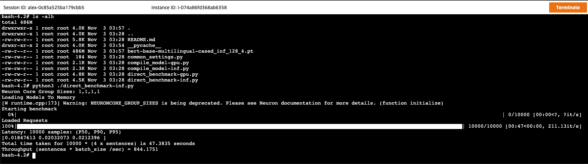
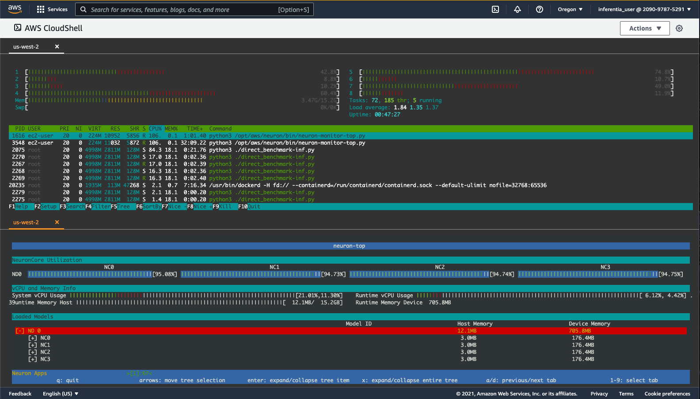
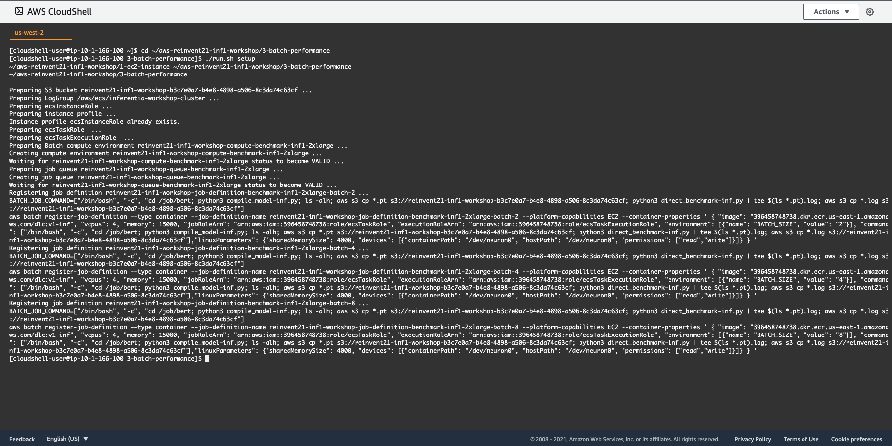
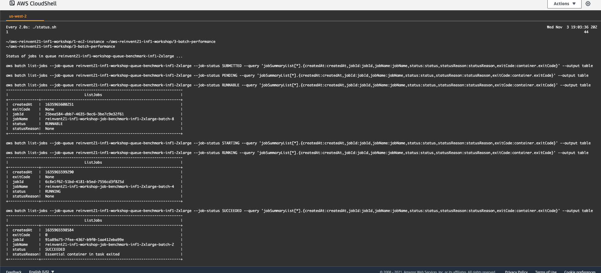

# AWS re:Invent 2021 Inferentia Workshop
**Welcome to the re:Invent 2021 Inferentia Workshop!**
<br/>
In this workshop, you will walk through three exercises to help you gain experience with AWS Inferentia. First, you will launch an AWS EC2 Inf1 instance. Next, you will compile and prepare a model for deployment. Lastly, you will deploy the model and analyze its performance on Inferentia. Each exercise is contained in a subdirectory, however, the exercises need to be completed in order since the latter exercises depend on artifacts produced by previous ones. 

<div align="center">

<br/>
Fig. 1 - Workshop architecture
</div>
<br/>

First we will provision an Inferentia instance, then we will build a deep learning container and use it to compile and run a model on the Inferentia chip, and finally we will use AWS Batch to automatically run a model on Inferentia and benchmark it with different batch sizes.  

---

## 0) Prerequisites
Before we get started, you will need to set up your AWS account and open a CloudShell terminal. You will use this terminal for the rest of the workshop. You will not be required to install anything on your computer, as all of the exercises will be completed on the cloud through your browser.

### 0.1) AWS account
For this workshop, you may use your own AWS account, or use an account generated by AWS Event Engine. If you are using your own AWS account, please proceed to Section 0.2. 
If you would like to receive a temporary AWS Account through AWS Event Engine follow these steps:

1. Go to https://dashboard.eventengine.run/login
2. Read the Terms and Conditions
3. Enter the provided Event Hash (e.g. abcd-0123456789-ef)
4. Select a sign-in method and proceed to sign-in to the AWS Console 

Once you have completed these steps, proceed to Section 0.2

### 0.2) IAM user with admin rights
Once logged into the account through the [AWS console](https://console.aws.amazon.com/console/home?region=us-west-2#), navigate to [IAM Users](https://console.aws.amazon.com/iamv2/home?#/users) and add a new user by clicking the **Add users** button and filling out the form as shown below. Use **inferentia_user** as the User Name. 
<div align="center">

<br/>
Fig. 2 - Add user screen
</div>
<br/>

Click **Next: Permissions** and select the **admins** group as shown on the figure below.
<div align="center">

<br/>
Fig. 3 - Add user to admins group
</div>

In case the **admins** group does not exist, it can be created through the **Create group** button, providing group name **admins** and selecting the **AdministratorAccess** policy as shown below.

<div align="center">

<br/>
Fig. 4 - Create group
</div>
<br/>

Follow the wizard through to the end to create the user (remaining options can be left as default). When the user is added successfully, you will see a confirmation screen from which you can copy the user's Access Key and Secret Access Key. 
<div align="center">

<br/>
Fig. 5 - Confirmation screen with access key information for new user
</div>
<br/>

Save the **Access key ID** and **Secret access key** locally as you will need to enter them later while you are completing the exercises in this workshop. This is the only time these credentials will be available for download. When you close the screen, the credentials will not be available for download when you visit the screen again. You will be able to generate new credentials if necessary.
To download the credentials either press the **Show** link and copy/paste them from the screen to a safe place, or click the "Download .csv" button to download the credentials as a .csv file.

### 0.3) Sign into the AWS Console
In this step you will sign in to the AWS Console as the user you just created.
Pull down the user menu from your current AWS Console screen and copy the Account number displayed next to **My Account** as shown on the figure below.
<div align="center">

<br/>
Fig. 6 - Sign out of AWS Console
</div>
<br/>

Once you have copied the account number, cick **Sign Out**, then click **Sign In to the Console**.

<div align="center">

<br/>
Fig. 7 - Sign in landing screen
</div>
<br/>

On the **Sign in** screen select **IAM user**, enter the **Account ID** that you just copied, and click Next.

<div align="center">

<br/>
Fig. 8 - Sign in as IAM user
</div>
<br/>

When presented with the login screen shown below, fill in the IAM username and password that you created in the previous step.

Next, click the **Sign in** button and sign in as the new IAM user.


### 0.4) Start CloudShell
We will use [CloudShell](https://console.aws.amazon.com/cloudshell/home?region=us-west-2#) to execute the steps in this workshop. To provision a CloudShell, pull down the **Services** menu (from the top left of the screen) and select **CloudShell** from the **Developer Tools** section, or just right click and open the following [link to CloudShell](https://console.aws.amazon.com/cloudshell/home?region=us-west-2#).

<div align="center">

<br/>
Fig. 9 - CloudShell link
</div>
<br/>

Your CloudShell instance will launch automatically and you will be dropped into a web terminal.
_**Note**: It may take a few minutes to prepare the environment, if this is your first time using it._

<div align="center">

<br/>
Fig. 10 - CloudShell terminal
</div>
<br/>

### 0.5) Clone Workshop Repository

Clone the [workshop repository](https://github.com/aws-samples/aws-reinvent21-inf1-workshop) into your CloudShell.

```
git clone https://github.com/aws-samples/aws-reinvent21-inf1-workshop
```

Setup for the workshop is now complete and you are ready to proceed with the exercises below.

---

## 1) EC2 Instance
In this exercise you will launch an Inferentia instance, connect to it, and become familiar with several useful Inferentia-specific utilities. This repository supports two ways of launching an Inferentia EC2 instance:

* Configuring and creating an EC2 launch template, then using the template to launch an instance via [`./template-launch.sh`](1-ec2-instance/template-launch.sh). In part 3 of the workshop, we will need to use this launch template in order to configure an AWS Batch job. That is why we will use this method for the workshop. All of the scripts and configuration required to complete the task are located in directory [`1-ec2-instance`](1-ec2-instance)
* Directly launching the instance via the AWS CLI using the [`./launch.sh`](1-ec2-instance/launch.sh) script, according to configuration provided in [`ec2.conf`](1-ec2-instance/ec2.conf). This method is provided as an example, but will not be used in this workshop.
 
### 1.1) Config

To configure the EC2 instance, open your CloudShell window and execute: 

```
cd aws-reinvent21-inf1-workshop/1-ec2-instance
./config.sh
```

<div align="center">

<br/>
Fig. 11 - EC2 instance config
</div>
<br/>

The [`./config.sh`](1-ec2-instance/config.sh) script will ask you to enter the following:

* **Access  key id** from Section 0
* **Secret access key** from Section 0
* Enter **us-west-2** for the Region
* Enter **json** for the Output Format

The configuration file [`ec2.conf`](1-ec2-instance/ec2.conf) will automatically be opened using the 'vi' editor. The purpose of showing the configuration file is to become familiar with its content. Note that the **EC2_SUBNET_ID** setting is left blank. This means that the instance can be launched in any availability zone and public subnet in your VPC where there is capacity. The configuration can be restricted to a single subnet by specifying a subnet id. You can see a list of VPCs and Subnets in your account by executing scripts [`./vpc-list.sh`](1-ec2-instance/vpc-list.sh) and [`./subnet-list.sh`](1-ec2-instance/subnet-list.sh). These scripts are provided here for your information and exploration. 
 
You are not required to change any of the values in the [`ec2.conf`](1-ec2-instance/ec2.conf) file. After you are done reviewing it, you can exit `vi` by pressing `Esc : q Enter`. 

Once you exit the `vi` editor, the script [`./template-config.sh`](1-ec2-instance/template-config.sh) will be executed and will generate a launch template configuration based on the content of the [`ec2.conf`](1-ec2-instance/ec2.conf) file. The template file will be printed on the screen.

Review the template file. If you would like to make any changes, you can repeat the config step or manually edit the generated launch template file before using it in the next step.

### 1.2) Create Template and Launch EC2 Instance
Next, execute the following two scripts to create the template and use it to launch an AWS EC2 Inf1 instance.

```
./template-create.sh
./template-launch.sh
```
 
 An instance will be provisioned and you will see a message like the one below:

```
Instance i-xxxxxxxxxxxxxxxxx launched from template reinvent21-inf1-workshop
```

_**Note**:<br/>
 <font size=-1>
 Depending on current workloads and your subnet mapping, there is a chance for the availability zone that your subnet is located in to not have the particular Inferentia instance type available. If that happens an instance will not be provisioned and you will receive an **InsufficientInstanceCapacity** error. If this occurs, execute [`./subnet-list.sh`](1-ec2-instance/subnet.list.sh) and select a different subnet than the one currently being used, configure the `EC_SUBNET_ID` value in [`ec2.conf`](1-ec2-instance/ec2.conf) and run [`./template-delete.sh`](1-ec2-instance/template-delete.sh), [`./template-config.sh`](1-ec2-instance/template-config.sh), before running [`./template-create.sh`](1-ec2-instance/template-create.sh) and [`./template-launch.sh`](1-ec2-instance/template-launch.sh) again.
 </font>_

### 1.3) Monitor EC2 Instance Status

To monitor the status of your instance, execute the following command:

```
watch ./list.sh
```

<div align="center">

<br/>
Fig. 12 - EC2 instance status
</div>
<br/>

Once the instance enters status `running` please wait for about 3 minutes to allow the instance to start fully and update its Neuron SDK deployment. You can then press `Ctrl-C` to return to the command prompt. We are now ready to connect to the instance.

### 1.4) Connect to the AWS EC2 Inf1 Instance

As mentioned at the beginning of Section 1, there are different ways to connect an Inferentia instance, but in this exercise we will just run the [`./connect.sh`](1-ec2-instance/connect.sh) script.


```
./connect.sh
```

<div align="center">

<br/>
Fig. 13 - EC2 instance connection successful
</div>
<br/>

 _**Note**:<br/>
 <font size=-1>
 CloudShell sessions have [time limits](https://docs.aws.amazon.com/cloudshell/latest/userguide/limits.html#session-lifecycle-limitations) and will automatically terminate after 20-30 minutes of inactivity. You can start a new session immediately after your session is terminated, however the new CloudShell will have a different IP address. In order to allow connections to the inf1 EC2 instance from the new IP address, before running the [`./connect.sh`](1-ec2-instance/connect.sh) script, execute [`./authorize.sh`](1-ec2-instance/authorize.sh).
 </font>_

### 1.5) Monitor Resource Utilization

Once connected to the Inferentia instance, let's become familiar with some utilities that can be used to monitor utilization of the instance resources.

#### 1.5.1) neuron-ls
This utility is installed as part of the Neuron SDK. It lists the available Inferentia processors a.k.a. Neuron devices on your AWS EC2 Inf1 instance.

<div align="center">

<br/>
Fig. 14 - neuron-ls utility
</div>
<br/>

#### 1.5.2) htop
This utility shows the CPU and memory utilization on your AWS EC2 Inf1 instance. By default `htop` is not installed as it is a generic linux utility and not a part of the Neuron SDK. Please install it by running the command below:

```
sudo yum install -y htop
```

#### 1.5.3) neuron-top
This utility shows the utilization of the Neuron cores on your AWS EC2 Inf1 instance.

Before we proceed further, let's split the cloud shell window into two rows. In the upper right corner select `Actions->Split into rows`.

<div align="center">

<br/>
Fig. 15 - Split CloudShell into two rows
</div>
<br/>

Execute the following commands in the bottom row of CloudShell to establish a second connection to the Inferentia instance:
```
cd aws-reinvent21-inf1-workshop/1-ec2-instance
./connect.sh
```

When both the top and bottom shell windows are connected, 
in the top row execute 

```
htop
``` 
and in the bottom row execute 
```
neuron-top
```
This allows us to monitor the utilization of both CPU and Neuron resources of the Inferentia EC2 instance in real-time. 

<div align="center">

<br/>
Fig. 16 - Live instance monitoring using htop and neuron-htop
</div>
<br/>

**You have completed Exercise 1!**<br/>
In this exercise you created an AWS EC2 Inf1 instance and learned how to monitor utilization of its CPU and Neuron resources. 
<br/> _Note: Leave this window open so you can see the utilization of the Neuron cores while we run a model on this instance._

---

## 2) Deep Learning Container
Building and running deep learning containers is essential to the deployment of self-managed ML workloads. In this exercise, you will build a Docker image which contains the [Neuron SDK](https://awsdocs-neuron.readthedocs-hosted.com/en/latest/index.html), as well as all necessary drivers and packages required to successfully compile and run models on Inferentia. You will also walk through the manual process of compiling, running, and benchmarking a model. Lastly, you will push the container image to the AWS Elastic Container Registry [ECR](https://console.aws.amazon.com/ecr/repositories?region=us-west-2) for use in the next section and then will terminate the instance.

Since we concluded the previous exercise with launching utilization monitors in the CloudShell, we will keep that window open and will use a different way to connect to the Inferentia instance for this part of the workshop.

### 2.1) Connect to AWS EC2 Inf1 Instance via Session Manager

Open the [EC2 Console](https://console.aws.amazon.com/ec2/v2/home?region=us-west-2#Instances:) and select the Inferentia instance, then click the **Connect** button and select the **Session Manager** tab. 

<div align="center">

<br/>
Fig. 17 - Connect on EC2 instance via SSM
</div>
<br/>

Using Session Manager to connect opens a terminal in your browser logged into the instance as `ssm-user`.  

To login as `ec2-user` and set the current directory to the user's home, execute: 
```
sudo su ec2-user
cd ~
```

<div align="center">

<br/>
Fig. 18 - sudo su ec2-user
</div>
<br/>

### 2.2) Clone Workshop Repository
To start, clone the workshop repository into the AWS EC2 Inf1 instance.

```
git clone https://github.com/aws-samples/aws-reinvent21-inf1-workshop
```

All of the scripts needed for this part of the workshop are located in directory [2-dl-container](2-dl-container).

```
cd aws-reinvent21-inf1-workshop/2-dl-container
```

### 2.3) Config

To prepare the exercise for execution, we will first run the [`./config.sh`](2-dl-container/config.sh) script.

```
./config.sh
```

The [`./config.sh`](1-ec2-instance/config.sh) script will ask you to enter the following:

*  **Access key id** from Section 0
*  **Secret access key** from Section 0
*  Enter **us-west-2** for the Region
*  Enter **json** for the Output Format


After configuring the aws client, the `config.sh` script will open the [`dlc.conf`](2-dl-container/dlc.conf) file for your review and editing in `vi`. If you wish to change anything in the file, press `i` to enter insert mode and then edit the desired values. When done reviewing/editing, save the file and exit `vi` by pressing `Esc : wq Enter`. Finally the config script will ensure an ECR registry exists for the image name specified in [`dlc.conf`](2-dl-container/dlc.conf).

Optionally, you can verify that the image repository was created successfully by reviewing the list of repositories in [Elastic Container Registry](https://console.aws.amazon.com/ecr/repositories?region=us-west-2) through the AWS Console.

<div align="center">

<br/>
Fig. 19 - Image repository in ECR
</div>
<br/>

### 2.4) Build and Push Container Image

Next, execute the following sequence of scripts to build and push the deep learning container image to ECR. _Note: This step may take up to 12 mins to complete._ 

```
./build.sh
./login.sh
./push.sh
```

<div align="center">

<br/>
Fig. 20 - Build and push image to ECR
</div>
<br/>

### 2.5) Run the Container Locally
Let us now start the container locally and manually run a model benchmark.
For a detailed explanation of how the benchmarking code works, please refer to the [benchmarking job documentation](2-dl-container/Container-Root/job/README.md).

Execute 
```
./run.sh bash
```
 and you will be dropped into a shell within the container.


#### 2.5.1) Compile the Model for Inferentia

To compile the `BERT` model, change the current directory to [`bert`](2-dl-container/ContainerRoot/job/bert) and run the [`compile_model-inf.py`](2-dl-container/ContainerRoot/job/bert/compile_model-inf.py) script.

```
cd bert
python3 compile_model-inf.py
```

<div align="center">

<br/>
Fig. 21 - Compile Bert model
</div>
<br/>

<p>
Notice that upon successful completion, compile_model-inf.py produces a `.pt` file, which is the compiled model serialized as torch-script.
</p>

#### 2.5.2) Run a Model Performance Test
To evaluate the model performance on Inferentia, we will run the [`direct_benchmark-inf.py`](2-dl-container/ContainerRoot/job/bert/direct_benchmark-inf.py) script.
While executing the benchmark script, monitor your CloudShell window where `htop` and `neuron-top` are running to observe the Neuron core utilization while the test is running on the Inferentia processor.

_**Note**:<br/>
<font size=-1>
If your CloudShell session has timed out, you may have to start a new session and split it again into 2 shell rows, then from the first shell execute `cd aws-reinvent21-inf1-workshop/1-ec2-instance; ./authorize.sh; ./connect.sh` and from the second shell execute `cd aws-reinvent21-inf1-workshop/1-ec2-instance; ./connect.sh`.
</font>_

```
ls -alh
python3 direct_benchmark-inf.py
```

<div align="center">

<br/>
Fig. 22 - Benchmark result
</div>
<br/>

<div align="center">

<br/>
Fig. 23 - Neuron core utilization
</div>
<br/>

### 2.6) Clean up

To wrap up this part of the workshop, we are going to stop the container and terminate the EC2 instance by executing the following:

#### 2.6.1) Stop Container
```
exit
./stop.sh
```
This exits the container and stops it.

#### 2.6.2) Return to CloudShell

Close the Session Manager window. Go back to the CloudShell window and exit the monitoring tools by pressing `q` or `Ctrl-C` in each of the shell windows to return to the command shell. You may also close one of the shell panes, or just refresh the browser window.

#### 2.6.3) Terminate AWS EC2 Inf1 Instance
To terminate the AWS EC2 Inf1 instance, execute the following in CloudShell: 

```
cd ~/aws-reinvent21-inf1-workshop/1-ec2-instance
./terminate.sh
./list.sh
```

<div align="center">

<br/>
Fig. 24 - Terminate Inf1 EC2 Instance
</div>
<br/>

Execute 
```
watch ./list.sh
```
and wait until the status of the instance shows as `terminated`. Then press `Ctrl-C` to return to the command shell.

_**Note**:<br/>
The AWS EC2 Inf1 instance must be terminated prior to proceeding to the next exercise. This is necessary in order to conform to a default service quota for Inf1 instances in Event Engine._ 

**You have completed the second exercise of the workshop!**<br/>
In this exercise you built a deep learning container, pushed the container image to ECR, and ran it locally to trace an NLP model and run it on Inferentia while monitoring resource utilization of the instance. You have also terminated the instance to prepare your account for the next exercise.

In the next exercise you will run a few instances of the model, using the image you pushed to ECR.

---

## 3) Batch size performance optimization
In this exercise you will use scripts that utilize the AWS CLI to create an Inferentia compute environment in AWS Batch. You will submit benchmark jobs with different batch sizes to this compute environment. A model will be compiled for each batch size and uploaded to S3. A benchmark log will also be saved for each batch size and uploaded to S3. When all models and logs have been uploaded, you will run a report that parses the logs and extracts metrics that help you compare the performance of the model at different request batch sizes.

The scripts used in this part of the tutorial are located in directory [`3-batch-performance`](3-batch-performance), however artifacts and configuration from the previous two exercises are used in this section as well. The configuration settings for this section are available in file [`batch.conf`](3-batch-performance/batch.conf). The instance types and batch sizes configured by default have been optimized for use with AWS Event Engine accounts. 

To complete this exercise, we will use the following workflow:

```
Setup batch compute environment ---> Submit batch jobs ---> Monitor batch jobs until they complete ---> Report and analyze batch job results ---> Clean up batch compute environment
```

### 3.1) Setup AWS Batch Compute Environment

To setup the compute environment, execute:

```
cd ~/aws-reinvent21-inf1-workshop/3-batch-performance
./run.sh setup
```

<div align="center">

<br/>
Fig. 25 - Setup AWS Batch compute environment
</div>
<br/>

Optionally, you can view the compute environment in the AWS console by visiting [AWS Batch > Compute Environments](https://console.aws.amazon.com/batch/home?region=us-west-2#compute-environments)

### 3.2) Submit Batch Jobs

Next, we will compile and benchmark the `BERT` model for batch sizes 2, 4, and 8.
To submit the benchmark jobs, execute:

```
./run.sh submit
```

<div align="center">

<br/>
Fig. 26 - Submit Batch jobs
</div>
<br/>

### 3.3) Monitor Batch jobs

Once the jobs have been successfully submitted, execute the following command to monitor their status:

```
watch ./status.sh
```

<div align="center">

<br/>
Fig. 27 - Monitor Batch job status
</div>
<br/>

Execution of each of the jobs may take between 5 and 10 minutes. If for any reason you would like to cancel any non-finished jobs, execute the `./stop.sh` script.

While waiting for the jobs to finish running, you may explore [Batch](https://console.aws.amazon.com/batch/home?region=us-west-2#firstRun) through the AWS Console.
The compute environment you created will be listed under [Compute environments](https://console.aws.amazon.com/batch/home?region=us-west-2#compute-environments). You can also review the [Job queues](https://console.aws.amazon.com/batch/home?region=us-west-2#queues), [Job definitions](https://console.aws.amazon.com/batch/home?region=us-west-2#job-definition), and [Jobs](https://console.aws.amazon.com/batch/home?region=us-west-2#jobs).

<div align="center">

<br/>
Fig. 28 - Batch jobs
</div>
<br/>

To see the current jobs, toggle "Searching and filtering" to Enable, then select the job queue from the pull-down.

If you select a job that is in status `RUNNING`, `SUCCEEDED`, or `FAILED`, you will see a link to the job's [CloudWatch](https://console.aws.amazon.com/cloudwatch/home?region=us-west-2#logsV2:log-groups) log stream.

<div align="center">

<br/>
Fig. 29 - Batch job details
</div>
<br/>

Following the log stream name link will open the job's CloudWatch log.

<div align="center">

<br/>
Fig. 30 - Batch job CloudWatch log stream
</div>
<br/>

If you wish to watch the log stream, scroll to the bottom of the log and click the `Resume` link to periodically retrieve new events.

### 3.4) Generate report

Once the jobs are in status `SUCCEEDED`, press `Ctrl-C` in CloudShell to return to the command prompt.

The traced models and job execution logs have been uploaded to [S3](https://s3.console.aws.amazon.com/s3/home?region=us-west-2#). 

<div align="center">

<br/>
Fig. 31 - S3 bucket list
</div>
<br/>

To parse the logs and produce a summary report, execute:

```
./run.sh report
```

<div align="center">

<br/>
Fig. 32 - Batch job report
</div>
<br/>

A CSV report will be produced, comparing performance of the model with the different batch sizes. The report will also be uploaded to S3 and saved alongside the compiled models and logs. 

Inspecting the benchmarking report, we can see that increasing the batch size increases the throughput, but also increases the latency of the model responses.

If you wish to explore more details about any of the lines of the report, review the content of the corresponding `.log` and `.json` file in the current directory.

<div align="center">

<br/>
Fig. 33 - Batch job report details
</div>
<br/>

The `.log` files are produced by using the direct benchmark scripts, while the `.json` files are produced using the `neuronperf` benchmark package which is part of the Neuron SDK. The two benchmarks are independent. They are included together for completeness and to demonstrate different ways that are available for measuring performance of models running on Inferentia. 

### 3.5) Bonus task (optional)
Now that you have completed optimizing the performance of the natural language processing `BERT` model on Inferentia, as a bonus task, configure the batch jobs to do the same for the computer vision model `RESNET`. You can start by editing the `DOE_MODEL_FAMILY` setting in [`batch.conf`](3-batch-performance/batch.conf). Then repeat steps 3.1 to 3.4 to generate a report which includes `RESNET`.

### 3.6) Clean up

Finally, let's clean up the compute environment by executing the following:

```
./run.sh cleanup
```

<div align="center">

<br/>
Fig. 34 - Cleanup Batch compute environment
</div>
<br/>

_**Note:**<br/>
<font size=-1>
If any error messages occur while the compute environment is being cleaned up, this would likely be due to variable timing while disabling and deleting components of the environment. Interrupting and re-running the cleanup step would resolve errors of this kind.</font>_

**You have completed the third and last exercise!**<br/>
In this exercise you used AWS Batch to explore how model performance is impacted by the choice of batch size in the request. Following a similar approach, through making configuration changes in the DOE section of [`batch.conf`](3-batch-performance/batch.conf), exploration can be expanded to other model parameters, other instance sizes, or EC2 instance types.

---

## Conclusion
**Congratulations!**<br/> 
You have completed the re:Invent 2021 Inferentia workshop! 
Through the exercises in this workshop you gained experience in provisioning Inferentia EC2 instances, compiling and running models on Inferentia using containers, and optimizing model performance with the help of AWS Batch. Although this workshop's examples focused on a BERT-based NLP model, please note that the same approach can be used for deployment and evaluation of other self-managed AI & ML models on AWS Inferentia. 

## References
* [AWS CloudShell](https://docs.aws.amazon.com/cloudshell/latest/userguide/welcome.html)
* [EC2 inf1 instance types](https://aws.amazon.com/ec2/instance-types/inf1/)
* [Neuron SDK](https://awsdocs-neuron.readthedocs-hosted.com/en/latest/index.html)
* [Docker](https://docker.com)
* [Elastic Container Registry](https://aws.amazon.com/ecr/)
* [Elastic Container Service](https://aws.amazon.com/ecs/)
* [AWS Batch](https://aws.amazon.com/batch/)
* [AWS re:Invent 2021](https://reinvent.awsevents.com/agenda/)

## Security

See [CONTRIBUTING](CONTRIBUTING.md#security-issue-notifications) for more information.

## License

This library is licensed under the MIT-0 License. See the [LICENSE](LICENSE) file.
